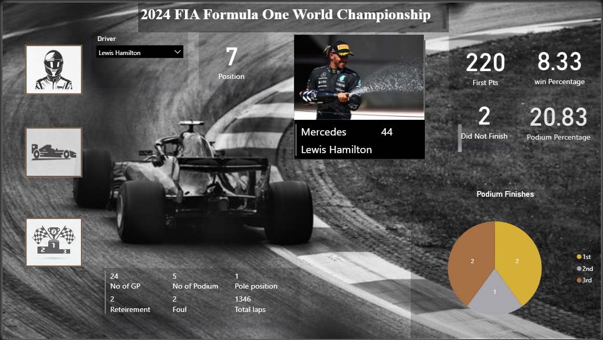
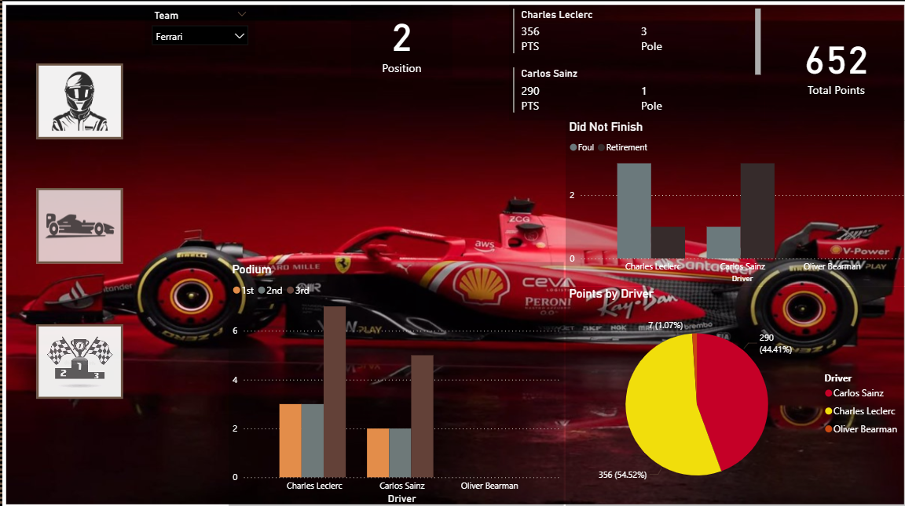
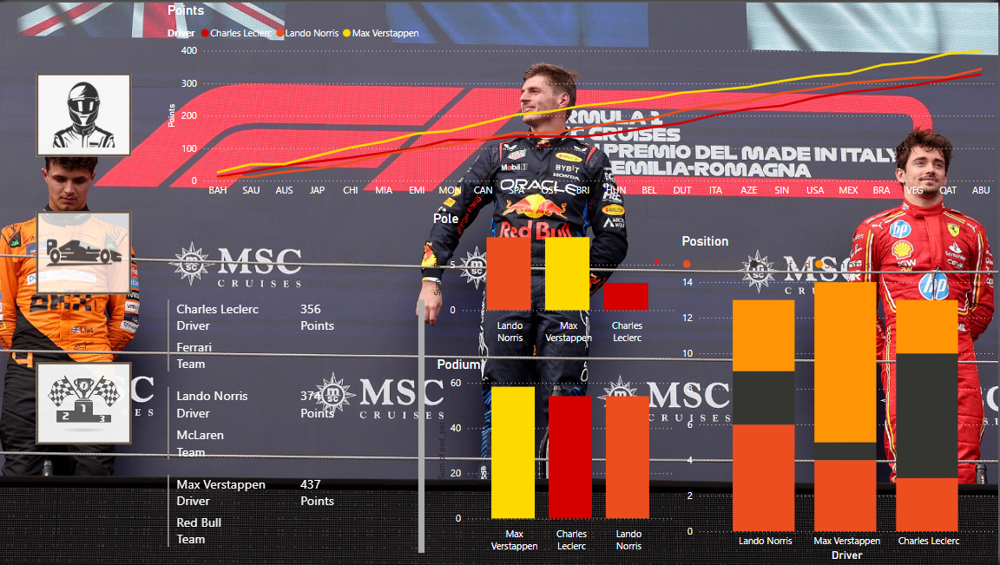
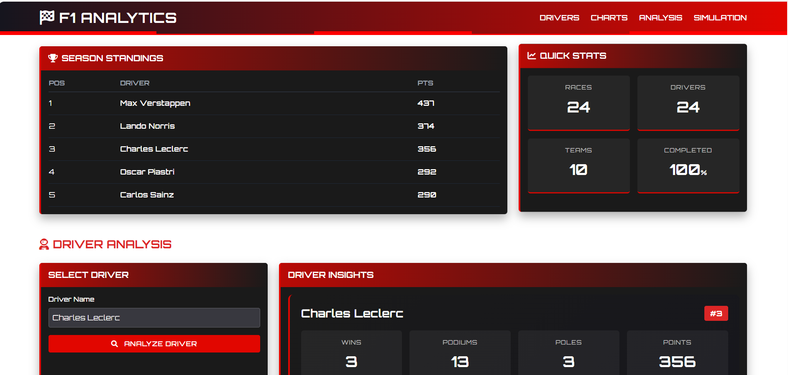
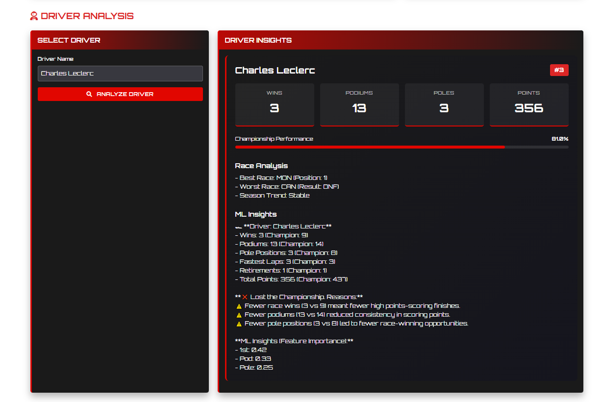
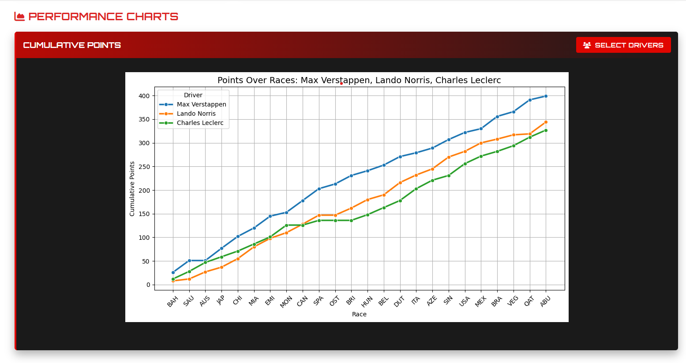
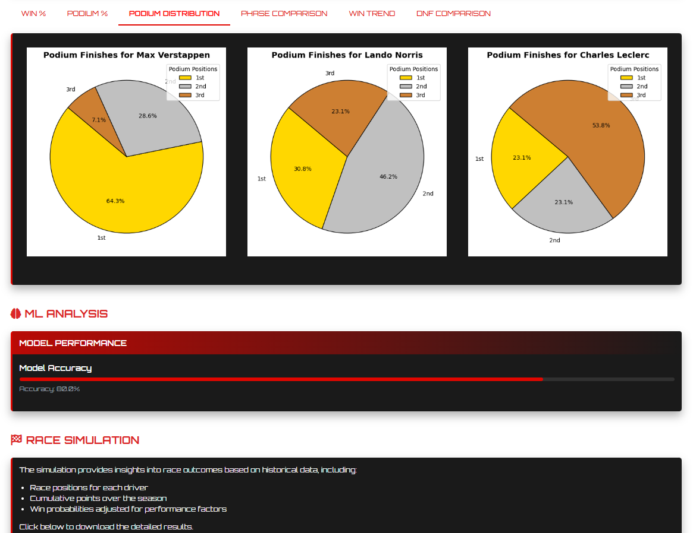

# 🏎️ F1 Championship Analytics

An end-to-end data science project that explores Formula 1 race data – from web scraping and data visualization to machine learning and game theory. This project uncovers performance patterns, driver comparisons, and winning probabilities using advanced analytics techniques.

---

## 📌 Project Flow

1. **🔍 Web Scraping**
   - F1 race data is scraped from an official source using BeautifulSoup.
   - Tables (driver standings, race results, etc.) are extracted and stored as structured CSV files.

2. **📊 Data Analysis**
   - **Top 3 driver comparison** across multiple races based on key performance indicators.
   - **In-depth comparison** between a selected driver and the season champion.

3. **📈 Visualization with Power BI**
   - Dashboard includes race-by-race breakdown, podium finishes, constructor stats, and driver profiles.
   - Filterable by driver, season, and location.

4. **🌲 Machine Learning – Feature Importance**
   - A **Random Forest model** is trained to determine which factors (e.g., qualifying position, lap time, tire strategy) most influence race victories.
   - Feature importance plots reveal key contributors to performance.

5. **♟️ Game Theory Simulation**
   - Winning probabilities for the championship are simulated using **Game Theory concepts**.
   - Models strategic decision-making across races and updates winning chances dynamically based on race outcomes.

---
## 📷 Sample Dashboard (Power BI)

Explore the Power BI dashboard to visualize key statistics across the F1 2024 season. Filter and analyze driver performances, race outcomes, and constructor contributions in an interactive format.





---
## 📷 Sample Dashboard (Flask)

Explore the Flask dashboard to visualize key Analysis across the F1 2024 season. Filter and analyze driver performances, race outcomes, and Deiver comparison in an interactive format.






---
## 🛠️ Tech Stack

- **Python** – Data scraping, processing, and ML modeling  
- **BeautifulSoup** – HTML parsing and table extraction  
- **Pandas & NumPy** – Data manipulation and analysis  
- **Scikit-learn** – Random Forest modeling  
- **Power BI** – Interactive data visualization  
- **Game Theory** – Strategic modeling of race outcomes

---

## 📁 Project Structure

```bash
├── data.py               # Flask app for scraping and Excel export
├── app.py                # Flask app for analysus
├── PowerBI/              # Power BI dashboard files
└── README.md             # Project overview and usage guide
---
